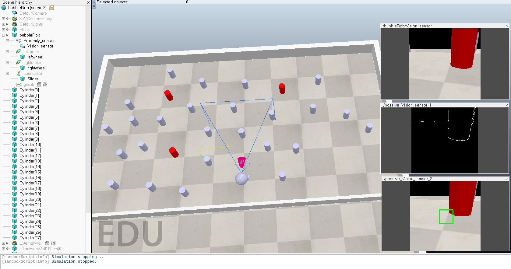

BubbleRob in CoppeliaSim with ZeroMQ Remote API
===
Introduction
---
This side project is based on the [CoppeliaSim BubbleRob tutorial](https://manual.coppeliarobotics.com/) (Tutorials -> BubbleRob tutorial). In this project, I have removed the child scripts and replaced them with a Python script using the [ZeroMQ Remote API](https://manual.coppeliarobotics.com/en/zmqRemoteApiOverview.htm). I utilized simple image processing and control strategies to enable BubbleRob to locate the red cylinder.

How to Use
---
1. Turn on CoppeliaSim.
2. Go to File -> Open scene -> `bubbleRob.ttt`.
3. Execute `control.py` in your IDE.

My Environment
---
- Ubuntu 20.04.6 LTS
- CoppeliaSim Edu V4.6.0 rev18 Ubuntu 20.04 [x86_64]
- Python 3.10.9

Python Packages:
- coppeliasim-zmqremoteapi-client 2.0.3
- pyzmq 23.2.0
- numpy 1.23.5
- opencv-python 4.9.0.80
- tqdm 4.64.1
- rich 13.7.1
